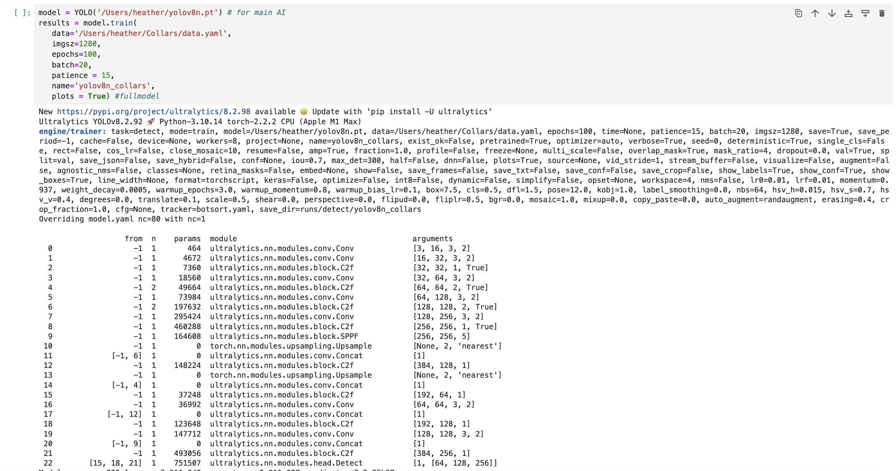
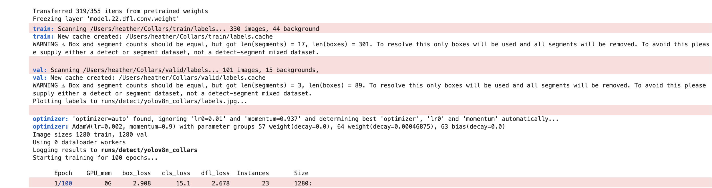
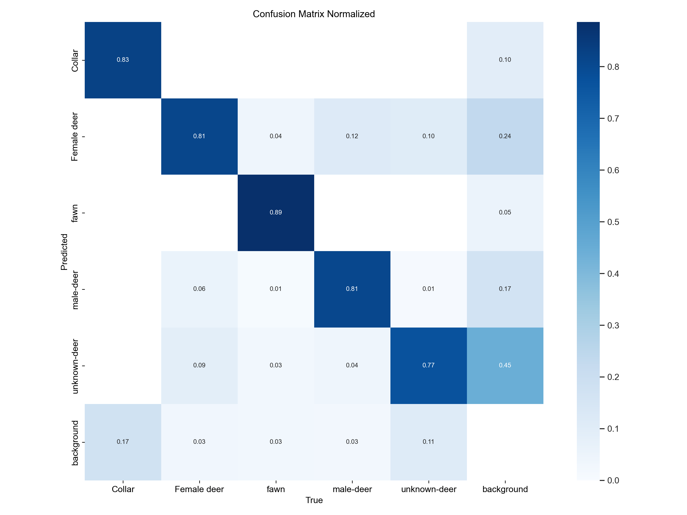
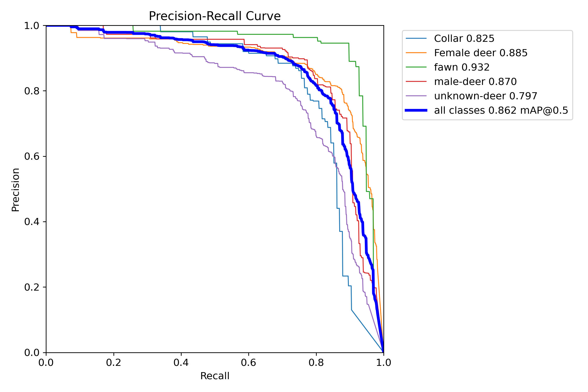
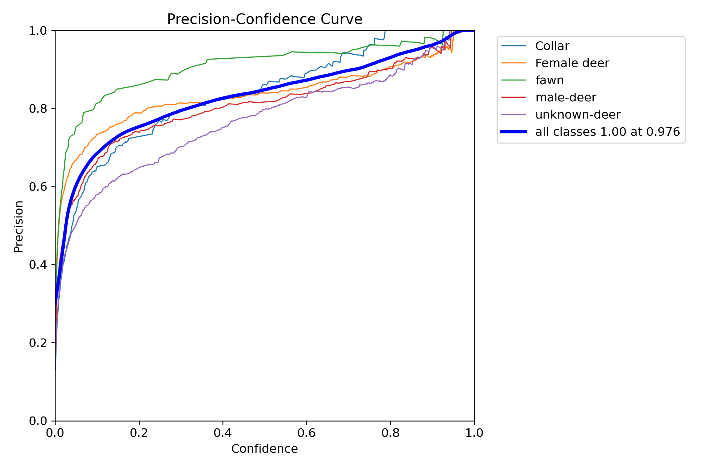
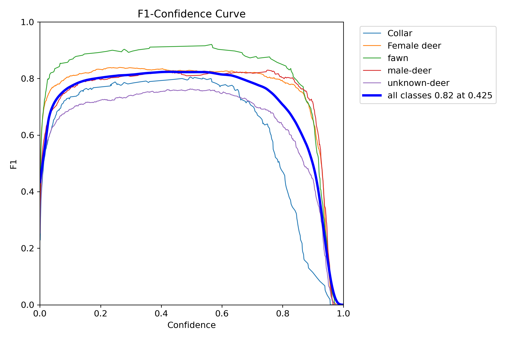

## Overview

Training an AI model is becoming increasingly simple thanks to modern
technology and the availability of openAI. Unfortunately, a lot of the
resources available are written for engineers and data scientists -
rarely are they written in a way that an average ecologist with an
annoying backlog of camera data can easily understand. Let's fix that.

This tutorial assumes you have:

-   a bunch of photos that need classifying

-   a pre-defined number of objects/animals/classes that you want to tag
    in photos

-   access to Python

-   Time

-   Already read Part 1 of this tutorial, to at least to Step 8
    (<https://github.com/heathergaya/JAGS-NIMBLE-Tutorials/tree/master/Image_AI>)

# Part 1 - Roboflow or Similar

If you've read Part 1 of this tutorial, you'll know that in order to
train an AI, you need to start with a tagged dataset. I personally enjoy
Roboflow as an easy image labeler (just using their free version), but
it's entire up to you. However you get the tagged dataset, you want it
to have bounding boxes around the objects in your images and be possible
to export into code in the format of YOLOv8.

If you've already created a "version" of your data in Roboflow, just
click "download dataset" and download it in the YOLOv8 format. Now
you're ready to go!

## Step 1 - Python training via the ultralytics package

We begin by loading libraries into Python. If you haven't used Python
before this can seem a little scary, but it's very similar to what we
would do in R using the "library()" function. If you get an error that
says "package NAME not available" or a similar error, this means you
need to install the package. In terminal, shell or even right in your
jupyter notebook, you can run the code "pip install NAME" first and then
this error will go away. After the intial install, you can comment out
that part of the code like I have below:

```{python, eval = F}
#%pip install ultralytics
from ultralytics import YOLO
import inference
import os
import shutil
import numpy as np
from collections import Counter
import supervision as sv
```

First step is to tell the ultralytics package what type of model you're
going to fit! Today we'll use the YOLOv9 model. A file called
"yolov8n.pt" will have been created somewhere on your computer when you
downloaded the ultralytics package. Tell Python where that file is
located:

```{python, eval = F}
model = YOLO('/Users/heather/yolov8n.pt') # for main AI
```

Now we can train a model! Crazy easy! We will need to know where our
tagged dataset is located, but otherwise we are good to go. To train the
model, we'll run something like this:

```{python, eval = F}
results = model.train(
   data='/Users/heather/Deer/data.yaml',
   imgsz=1280,
   epochs=100,
   batch=32,
   patience = 15,
   name='yolov8n_deer',
   plots = True) #fullmodel
```

Here's what's happening in the above code:

-   First, we're telling python where our tagged dataset is located. In
    my case, my data is found in my Users/heather/Deer folder. I have
    directed python to the ".yaml" file within this folder, which will
    help it know which tags are found in which folder. If you used
    Roboflow, this file will be created automatically for you, so just
    tell python the path to find it on your computer

-   Imgsz refers to the size of the images. Lower resolution images will
    train faster, but performance will suffer. 1280 is a decent
    resolution for something large like a deer, but you can change this
    if your images are at a different pixel resolution

-   Epochs refers to how many times you're going to try and fit the
    model. Think of this as iterations. A good strategy is to start with
    a lower number here (\<50) and see how the model trains, then
    increase this for future runs.

-   Batch is how many photos will be analyzed together. Setting your
    batch size to 16, 32 or 64 usually leads to the best results.
    Setting your batch size lowers increases training time, while
    increasing it can lead to slightly worse results. I'd recommend
    running training with batch size 32. If you have no idea, set batch
    = 1 and python will auto-calculate a good size based on your
    computer's hardware capacity.

-   Patience is how many times you want the model to change parameters
    without seeing any improvement before it gives up. The idea is that
    we want to fit the best model we can without over fitting. I find a
    patience of 10-20 will give you the best results. Setting this to 15
    would mean that if your model run for 15 epochs and doesn't improve,
    it will stop before the 16th, even if you set epoch to 200 or 2000
    or whatever.

-   The name is just whatever you want to name the output folder

-   plots = True is fun and good info, so best to leave it on.

Your python notebook will run for awhile (could take several days if you
have a large dataset!) Your console output will look something like the
following:

Great! Now let's see what sort of output we get from this.

## Step 2 - Model Stats

You'll get a variety of statistics from your model run that you can use
to either fit more models or to determine that your AI is doing what you
want and is ready to go!

Navigate to wherever python has put your results. For some reason mine
ends up in the runs/detect/nameofmymodel folder, but that might just be
my python settings.

The first result will an image called results.png. I don't find these
results particularly helpful. The plots in this image include box_loss
(how accurately did the model predict the bounding boxes for the
training dataset classes in each epoch), precision(B) (given the model
detected a class, how often was it correct. False negatives do not
affect precision), and Recall (This number is how often the model
identified SOMETHING was present, regardless of what it said that
something was. False positives don't affect this. ) Generally you would
hope that the more your model ran, the better these metrics got (box
loss got smaller, both recall and precision values got higher).

The next two files are the confusion matrix and the confusion matrix
normalized. The non-normalized one is counts of photos, normalized is
just proportions. This is a great way to see how your model is doing!
Each box represents how often the model identified a class given it's
true and predicted state. For instance, in the below matrix, we can see
that 81% of the time, the model labeled photos of female deer as female
deer, but for 6% of female deer photos it incorrectly tagged the female
as a male, 9% of the time it tagged the female as an unknown deer, and
3% of the time it didn't give the deer any tag at all.



The next few images tell you about recall and precision at different
confidence intervals. As confidence increases, your Precision will
increase - but your recall will decline. This makes sense - if you only
want the model to report results where it is very very sure about the
classification, it will tend to produce more false negatives. On the
other hand, it will give you junk results if you accept classifications
at super lower confidence levels. You can look at the "PR_curve" graph
to find the optimal confidence level to use for predicting classes in
new photos.



Let's say I wanted to minimize false negatives, so I want my model to
consistently detect at least 90% of the tags in a photo. Given the below
graph, that means I'd only expect about 50% of those detections to be
correct! That's not super helpful. So maybe I'll change my mind and
accept about 80% tag retention - that corresponds to about 80% of the
tags detected also being the correct class. I can live with that. Then I
could go check the precision graph (called "P_curve") and see that I'd
want to set my confidence at about 60%. Note that I could make this
decision at the class level, which is useful if your model is really
good at detecting some classes and not so good at others:

 You can also just look at the "F1 curve" plot which
tries to combine precision/recall into one metric (the harmonic mean of
precision and recall) and plots it against confidence. It's the same
concept. Either way, it's a subjective decision as to what confidence
interval you want to use. The best strategy is often to try and find the
highest confidence score you can use that won't drop your F1 score.
Based on the F1 curve below, I might choose a confidence of 85% for
Female deer, fawns and male-deer, but drop that confidence to 80% for
unknown deer and 65% for collars. Or I might say "man I need to train
this model better and give it more Collar photos!"



## Step 3 - Re-train the Model

Let's assume that model training attempt #1 did not give us the perfect
model. What to do? If you notice one class is failing more than the
others, the best solution is to add more data. If it seems like the
whole model is just kind of meh, trying running the model for more
epochs. If it still sucks, try adding more data with as much variety as
possible.

To re-train a model, you can save some time by using the model weights
from your previous model runs! The only thing you need to change is that
first line of code we ran that defined the model. Instead of using the
"yolo8n.pt" model, we'll use the model we just trained! Your model
should have created something called "best.pt" so just use that file
instead.

```{python, eval = F}
model = YOLO('/Users/heather/runs/detect/yolov8n_deer/weights/best.pt')
```

Then just re-run the model, but make sure to name it something you'll
remember:

```{python, eval = F}
results = model.train(
   data='/Users/heather/Deer/data.yaml',
   imgsz=1280,
   epochs=100,
   batch=32,
   patience = 15,
   name='yolov8n_deer_v2',
   plots = True) #fullmodel
```

## Step 4 - Use the Model

Alright, so let's say that we finally have a model we're happy with. How
do we use it?

If you just had one photo to process, you could just use something like
the following (where you'd replace my example image path with the path
to your own image):

```{python, eval = F}
results = model.predict('/Users/heather/deer/photo1.jpeg', conf= .5, verbose = False)
```

But this doesn't really give us output in a way that's helpful and if
you're only tagging 1 photo... well, I question why you built an AI at
all.

What I find is easiest is to create a function that takes each photo,
counts what's in the photo and then makes a folder of each unique
count/class combo. So for me, I might end up with folders called
"1Female deer", "1Female deer_1fawn", "2Male-deer",
"1unknown-deer_1fawn_1Male-deer" etc etc. If you only have one class
(say just "deer"), you could just end up with folders that count how
many deer are in each photo. Here's some code you can use to iterate
this process for all photos inside a subfolder. You would need to change
the image_folder line to reflect your own data path.

```{python, eval = F}
image_folder = '/Users/heather/Desktop/U_Georgia/Chandler_Meetings/heather/CWD_Postdoc/Billionphotos/GR31_07.05.24/MDoutput_07_05_24/animals/deer'
destination_folder = image_folder
    
def get_folder_name(predictions):
    class_counts = Counter(predictions)
    #print(class_counts)
    # If there are no class names, use "no_dets"
    if not class_counts:
        return "no_dets"
    
    # Create a list of class names with counts, sorted alphabetically by class name
    folder_parts = [f"{count}{class_name}" for class_name, count in sorted(class_counts.items())]

    # Join parts with underscores
    folder_name = "_".join(folder_parts)
    
    return folder_name


# Ensure destination folder exists
os.makedirs(destination_folder, exist_ok=True)

for filename in os.listdir(image_folder):
    # Check if the file is an image (you might want to adjust the extensions)
    if filename.lower().endswith(('.png', '.jpg', '.jpeg')):
        # Construct the full path to the image
        image_path = os.path.join(image_folder, filename)
        #print(image_path)
        # Process the image
        results = model.predict(image_path, conf= .5, verbose = False)
        
        # Define the destination path
        dest_folder = os.path.join(destination_folder, folder_name)
        # Create the folder if it doesn't exist
        os.makedirs(dest_folder, exist_ok=True)
        # Define the source and destination paths
        src_path = os.path.join(image_folder, filename)
        dest_path = os.path.join(dest_folder, filename)
        # Move the file
        shutil.move(src_path, dest_path)
        #print(f"Moved {src_path} to {dest_path}")

print("All images processed")
```

## Step 5 - Now What? 

If all has gone well, you should now have a bunch of folders with photos sorted into different groups based on the folder name. So... now what? 

Well, first I'd recommend double checking the AI. It will make mistakes. Move photos to their correct folders before analysis unless you have some alternative plan for accounting for incorrect tags. You could alternatively use the confidence matrix to model an observation process if you don't want to use manual checking. 

But more importantly, you now want to try and get the metadata from your photos into some sort of useful format. The program Camelot is quite popular, so I'll explain a method that lets you get the data into a CSV that can be either used for direct analysis or sent to Camelot for bulk-upload. 

The general idea is that we want to extract the metadata from each photo, then make one line in the CSV for each class detected. This code makes some modifications specific to deer, but you could remove or ignore those as needed for your own work. 

You will also need a separate CSV file that has GPS information about your camera array. Mine is called "camera_projected.csv".

```{python, eval = F}
import re
import os
import pandas as pd
from PIL import Image
from PIL import ExifTags
from PIL.ExifTags import TAGS, GPSTAGS
from datetime import datetime
import mimetypes
gps_stuff = pd.read_csv('/Users/heather/Desktop/U_Georgia/Chandler_Meetings/heather/CWD_Postdoc/Data/camera_projected.csv')
``` 

Next we need to define some functions. The first one extracts metadata, the second one makes it pretty and the third one is just splitting up our pathway so that we can subset our data just to certain animals/classes. This last step is only necessary because in my own data, I have all photos split into animal classes and then within the animal classes, only the deer get specfically counted and sexed/aged. 

```{python, eval = F}
def get_image_metadata(file_path):
    try:
        with Image.open(file_path) as img:
            # Extract basic metadata
            color_space = img.mode
            compression = img.info.get('compression', 'N/A')
            data_precision = img.info.get('dpi', 'N/A')
            exif_data = img._getexif() if hasattr(img, '_getexif') else None
            
            # Extract date/time if available
            date_time = None
            if exif_data:
                for tag, value in exif_data.items():
                    tag_name = ExifTags.TAGS.get(tag, tag)
                    if tag_name == 'DateTime':
                        date_time = value
            
            # Extract image dimensions
            exif_image_height = img.height
            exif_image_width = img.width
            
            # Extract additional EXIF data
            exposure_mode = None
            exposure_time = None
            flash = None
            camera_make = None
            camera_model = None
            
            if exif_data:
                for tag, value in exif_data.items():
                    tag_name = ExifTags.TAGS.get(tag, tag)
                    if tag_name == 'ExposureMode':
                        exposure_mode = value
                    elif tag_name == 'ExposureTime':
                        exposure_time = value
                    elif tag_name == 'Flash':
                        flash = value
                    elif tag_name == 'Make':
                        camera_make = value
                    elif tag_name == 'Model':
                        camera_model = value
            
            return {
                'Color Space': color_space,
                'Compression': compression,
                'Data Precision (DPI)': data_precision,
                'Date/Time': date_time,
                'Image Height': exif_image_height,
                'Image Width': exif_image_width,
                'Exposure Mode': exposure_mode,
                'Exposure Time': exposure_time,
                'Flash': flash,
                'Camera Make': camera_make,
                'Camera Model': camera_model
            }
    except Exception as e:
        return {key: None for key in [
            'Color Space', 'Compression', 'Data Precision (DPI)',
            'Date/Time', 'Image Height', 'Image Width',
            'Exposure Mode', 'Exposure Time', 'Flash',
            'Camera Make', 'Camera Model'
        ]}

def get_all_file_paths_and_metadata(directory):
    file_data = []
    
    for root, dirs, files in os.walk(directory):
        for file in files:
            file_path = os.path.join(root, file)
            file_size = os.path.getsize(file_path)  # Get file size in bytes
            mime_type = mimetypes.guess_type(file_path)[0]  # Get MIME type
            file_name = os.path.basename(file_path)  # Get file name

            metadata = get_image_metadata(file_path)
            file_data.append({
                'File Path': file_path,
                'File Name': file_name,
                'File Size (Bytes)': file_size,
                'Detected MIME Type': mime_type,
                **metadata
            })
    
    return file_data

def add_path_components(df):
    # Split the file path into components and get the last 7 excluding the file name
    # Note that if you had a shorter file path, you would probably not need 7 parts
    df[['Component 1', 'Component 2', 'Component 3', 'Component 4', 'Component 5', 'Component 6', 'Component 7']] = (
        df['File Path'].str.split('/', expand=True).iloc[:, -8:-1]
    )
```

Now we give python the location of our photo folder:
```{python, eval =F}
directory_to_search = '/Users/heather/Desktop/U_Georgia/Chandler_Meetings/heather/CWD_Postdoc/Billionphotos/Checked/GR66_07.03.24/MDoutput_07_03_24/animals'
# Get all file paths
file_dat = get_all_file_paths_and_metadata(directory_to_search)
# Create a DataFrame from the list of file paths
df = pd.DataFrame(file_dat)
add_path_components(df)
```

Awesome, this has extracted all our metadata. Now we want it to go through our folder system and get the tags/counts connected to the photos. At the end of all this, it creates a CSV with our data! Notice that this code is fairly deer specific - If you're just doing a model with one species and one group (aka just counting deer from a plane or something) you can skip everything after the line that says "df_exploded = subset_df.explode('Component 7_b')" (except the create csv part). 

```{python, eval = F}
## For the purpose of this script, remove all rows that aren't in deer folder:
subset_df1 = df[df['Component 6'] == 'deer']
subset_df = subset_df1[subset_df1['Detected MIME Type'] == 'image/jpeg']
# Make a column for camera name; unclear why there is a warning, but ignore it
subset_df.loc[:, 'cameraName'] = subset_df['Component 3'].str[:4]
#same idea with site name
subset_df.loc[:, 'siteName'] = subset_df['Component 3'].str[:2]
## Will need to make 2 columns for start and stop time for each camera. Insert those here:

#Next, merge Lat/Lon info
subset_df = subset_df.merge(gps_stuff[['Station', 'gps_y', 'gps_x']], 
                             left_on='cameraName', right_on='Station', 
                             how='left')

#Species Name Stuff:
subset_df.loc[:, 'commonName'] = 'White-tailed deer'
subset_df.loc[:, 'sciName'] = 'Odocoileus virginianus'
subset_df.loc[:, 'genus'] = 'Odocoileus'
subset_df.loc[:, 'family'] = 'Cervidae'
subset_df.loc[:, 'order'] = 'Artiodactyla'
subset_df.loc[:, 'class'] = 'Mammalia'
# could add in scientific species, family name, etc. 
def sum_numbers(s):
    numbers = re.findall(r'\d+', s)  # Find all sequences of digits
    return sum(map(int, numbers)) if numbers else 0  # Convert to int and sum

# Apply the function to 'Component 7' and create a new column 'groupSize'
subset_df['groupSize'] = subset_df['Component 7'].apply(sum_numbers)

#Next, we want to add new line for each class, retaining all other information 
subset_df['Component 7_b'] = subset_df['Component 7'].str.split('_')
# Use explode to create a new row for each split value
df_exploded = subset_df.explode('Component 7_b')

# Rename 'Path Component 7' to 'Classified'
df_exploded.rename(columns={'Component 7_b': 'Classified'}, inplace=True)

# Now we add in Sex:
def determine_sex(classified_value):
    if "fawn" in classified_value or "unknown" in classified_value:
        return "Unknown"
    elif "Female" in classified_value:
        return "Female"
    else:
        return "Male"

# Apply the function to the 'Classified' column to create/update the 'Sex' column

df_exploded['sex'] = df_exploded['Classified'].apply(determine_sex)

#Add in Age next:
def determine_lifestage(classified_value):
    if "fawn" in classified_value:
        return "fawn"
    elif "unknown" in classified_value:
        return "unknown"
    else:
        return "Adult"

# Apply the function to the 'Classified' column to create/update the 'Lifestage' column
df_exploded['lifestage'] = df_exploded['Classified'].apply(determine_lifestage)

## Add in quantity tag:
df_exploded['quantity'] = df_exploded['Classified'].str.extract('(\d+)').fillna(0).astype(int)

## Remove information for tagged friends:
df_exploded.loc[df_exploded['Classified'].str.contains('tagged', case=False, na=False), ['lifestage', 'sex']] = ''
df_exploded.loc[df_exploded['Classified'].str.contains('tagged', case=False, na=False), 'earTag'] = 'TRUE'
df_exploded.loc[df_exploded['Classified'].str.contains('tagged', case=False, na=False), 'groupSize'] = 0 #for now
df_exploded.loc[df_exploded['Classified'].str.contains('tagged', case=False, na=False), 'quantity'] = 500 #make it obvious


#More tag friend cleanup:
df_exploded['earTag'] = df_exploded['Classified'].str.contains('tagged', case=False, na=False).replace({True: 'TRUE', False: 'FALSE'})
df_exploded['MediaProcessed'] = df_exploded['earTag'].replace({'TRUE': 'FALSE', 'FALSE': 'TRUE'})
df_exploded.to_csv('Mycameradata.csv', index=False, escapechar='\\')
```

And there you go! A little gross, a little stressful but now we've got some tagged camera data! Much faster than manual! 